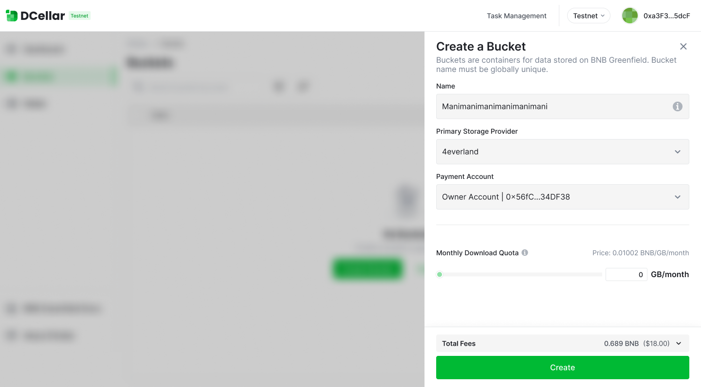
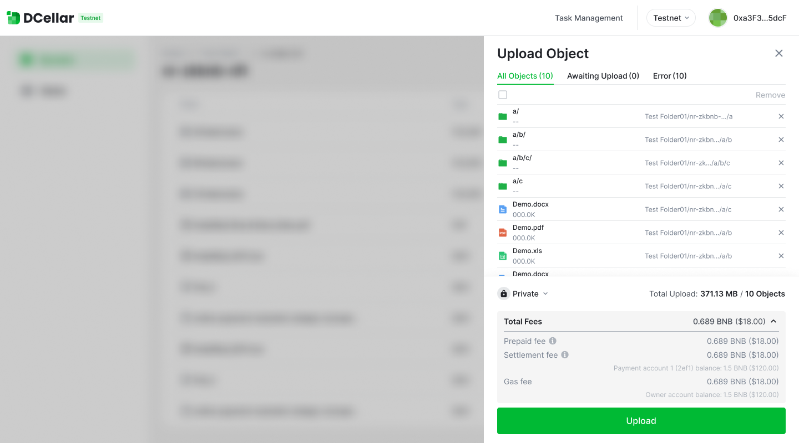
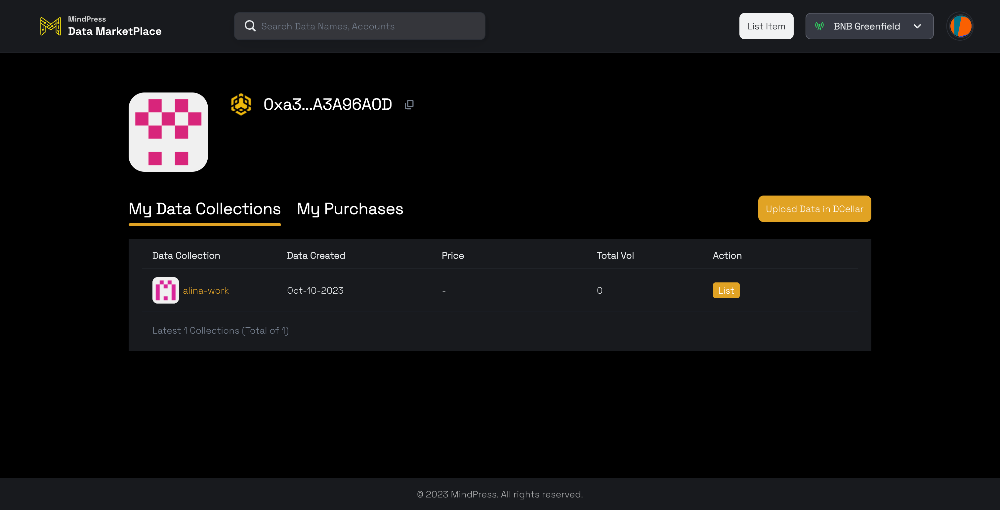
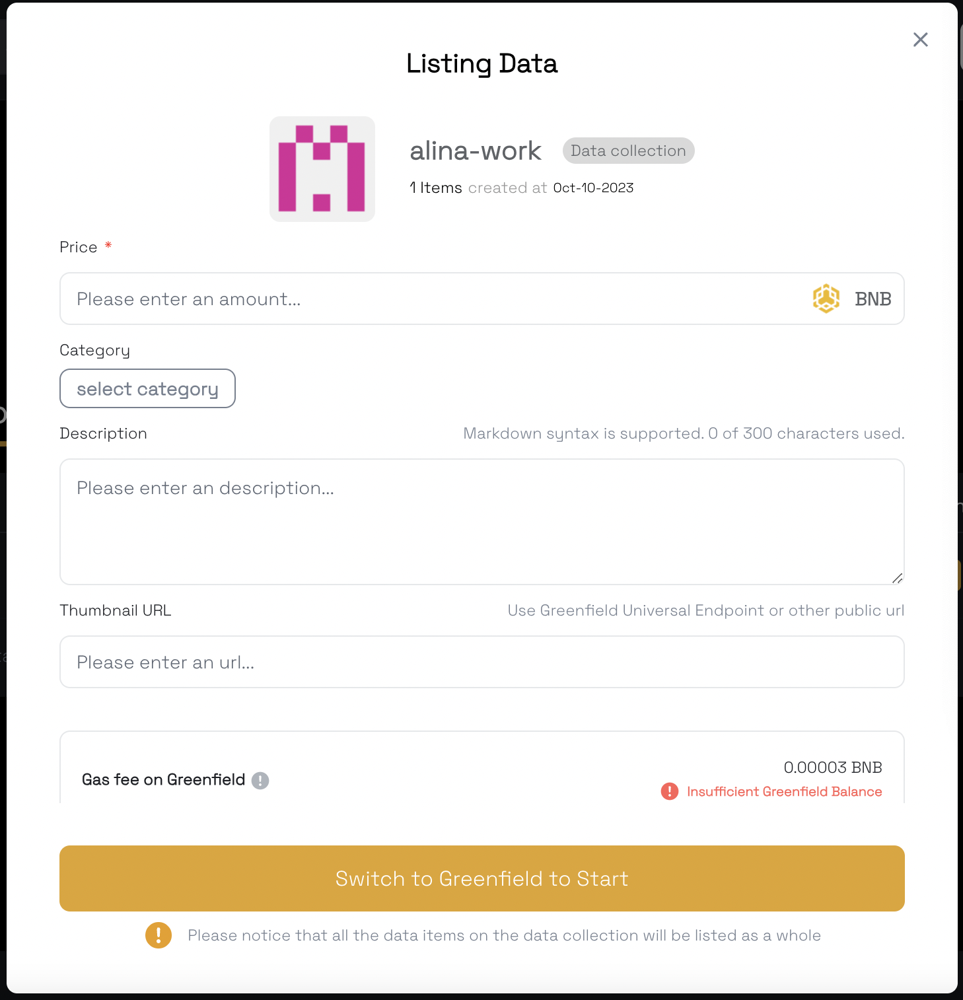
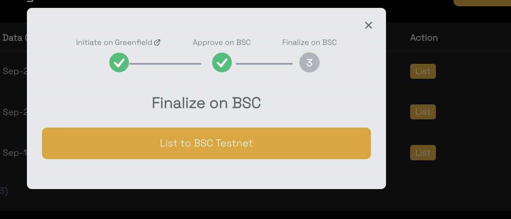
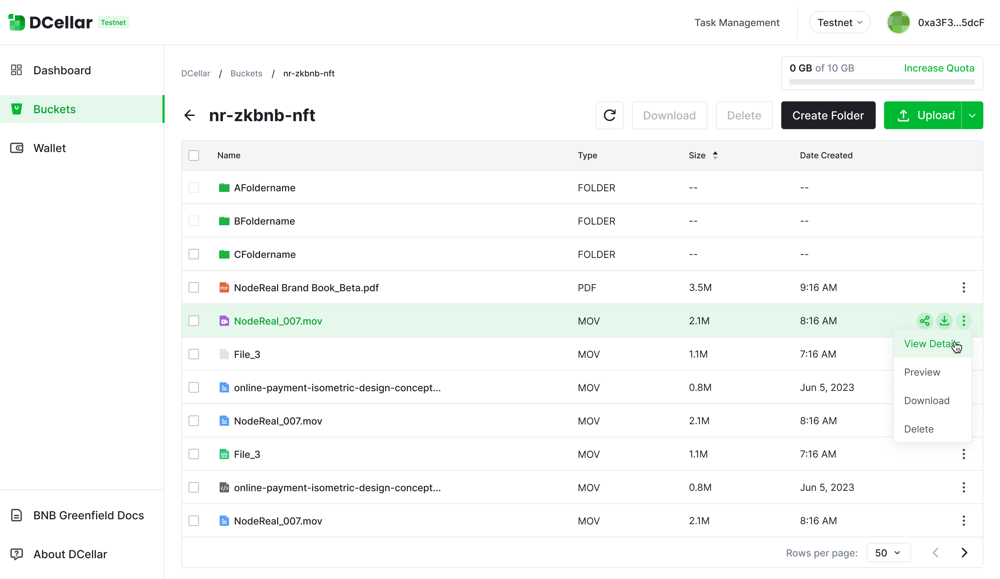
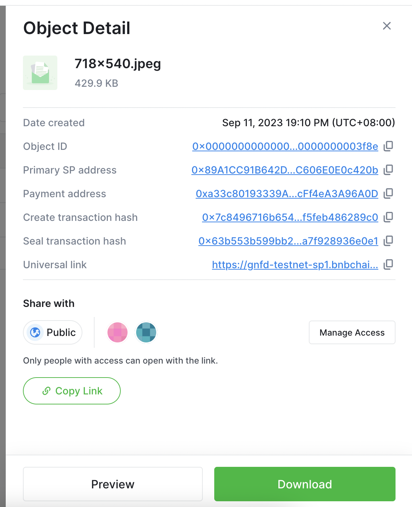

## Upload file to Greenfield

Before you start to sell your data, you need to make sure your data has been uploaded to Greenfield.

Here we suggest you use [DCellar](https://dcellar.io/), a developer tool that helps you upload data at ease.  Here is a [User guide](https://docs.nodereal.io/docs/dcellar-get-started) for DCellar. 

Create a **Bucket** , which will be identified as a **Data Collection** in Mindpress data marketplace.  So please carefully select your Bucket Name, it will be your Data Collection Name once you list the whole bucket for sell.  

Once you have succesfully create a bucet, you can start upload data objects into the bucket. Also please carefully select your data object names. 

You can upload multiple data objects at one time using DCellar. Please make sure your data properties are set as **Private**, otherwise anyone can view and download your data objects without purchasing. 

## List data for sell

Firstly, make sure you have created buckets and uploaded data objects on Greenfield. 

Then, Visit [Mindpress Data Marketplace](https://marketplace.mindpress.io/) , click **List My Data**

You can find your **Data Collection List** i.e. Bucket List. Select one Data Collection i.e. Bucket , click **list**. You can add a thumbnail, description and select a category.You can edit  these contents later after your sucessfully listed your Data Collection through editing function. 

 

Please set a price for your data collection. Once the price is set, you cannot change it , unless you delist the data collection and list it again. 

Please makesure you have enough Gas on Both Greenfield and BSC, listing will need you to sign thrice.

Also you can enter one of your data collection i.e. bucket, elect one of your data objects in the selected bucket, and list the single data object. 

Whether you have listed your data collection  i.e. bucket or not, you can still list one single data object within the  data collection  i.e. bucket.  Customer can choose to buy the whole  data collection  i.e. bucket or just buy a single data object within one  data collection  i.e. bucket. 

## Generate Thumbnail URLs using Greenfield 

You can use a public image on the Internet or you can generate a thumbnail URL using Greenfield.

To generate a thumbnail URL using Greenfield , you need to upload your thumbnail file to Greenfield, we suggest you use dcellar. 

Firstly you need to create a bucket, for better management,  you can name it  as "Thumbnail Resources". 

Then you can start upload thumbnail files into the bucket you have just created. Please make sure you have set the file property as **Public**, otherwise the thumbnail cannot be publicly visited thus cannot be  displayed correctly. 

Click view detail, you can find universal link of your thumbnail. 

You can use the universal link as your thumbnail url when you list data on Mindpress Data Marketplace.

## Buy Item 

You can see all the data on the Mindpress Homepage, select one and click **Buy**, it will cost you some gas fee on BSC. 

Once you have bought the data, you can view and download the data. 

If you have bought a data collection , you can view and download all the data objects within the  data collection.